# VictoriaLogs в Kubernetes: от установки до практического применения

Руководство по развёртыванию и использованию VictoriaLogs в Kubernetes. Документ фокусируется на практических шагах: установка через Helm, интеграция с cert-manager и Ingress, генерация логов, примеры запросов в LogsQL и интеграция с экосистемой наблюдаемости.


## Оглавление

- [VictoriaLogs в Kubernetes: от установки до практического применения](#victorialogs-в-kubernetes-от-установки-до-практического-применения)
  - [Оглавление](#оглавление)
  - [Введение](#введение)
  - [Ключевые концепции и преимущества](#ключевые-концепции-и-преимущества)
  - [Архитектура решения](#архитектура-решения)
  - [Подготовка к установке](#подготовка-к-установке)
  - [Установка компонентов (практика)](#установка-компонентов-практика)
    - [1) cert-manager](#1-cert-manager)
    - [2) VictoriaLogs Cluster](#2-victorialogs-cluster)
    - [3) collector (victoria-logs-collector)](#3-collector-victoria-logs-collector)
    - [4) VM K8s Stack (метрики, Grafana)](#4-vm-k8s-stack-метрики-grafana)
  - [Генерация тестовых логов](#генерация-тестовых-логов)
  - [Причина высокой производительности VictoriaLogs](#причина-высокой-производительности-victorialogs)
    - [Колоночное хранение каждого key](#колоночное-хранение-каждого-key)
    - [Читаем только нужные поля](#читаем-только-нужные-поля)
    - [Партиционирование по времени и потокам логов](#партиционирование-по-времени-и-потокам-логов)
    - [Хранение связанных логов рядом](#хранение-связанных-логов-рядом)
    - [Bloom-фильтры: не открывай блок, если там точно нет нужного](#bloom-фильтры-не-открывай-блок-если-там-точно-нет-нужного)
    - [Синергия оптимизаций](#синергия-оптимизаций)
  - [Быстрый вход в LogsQL (cheatsheet)](#быстрый-вход-в-logsql-cheatsheet)
  - [Руководство по LogsQL](#руководство-по-logsql)
    - [Содержание](#содержание)
  - [1. Фильтрация логов и временные фильтры](#1-фильтрация-логов-и-временные-фильтры)
  - [2. Примеры дашбордов / графиков](#2-примеры-дашбордов--графиков)
  - [3. LogsQL — язык запросов VictoriaLogs (кратко)](#3-logsql--язык-запросов-victorialogs-кратко)
    - [Примеры фильтров по полям](#примеры-фильтров-по-полям)
    - [Полнотекстовый поиск (full-text)](#полнотекстовый-поиск-full-text)
  - [4. Операторы пайплайна (часто используемые)](#4-операторы-пайплайна-часто-используемые)
  - [5. Извлечение данных и парсинг](#5-извлечение-данных-и-парсинг)
  - [6. Агрегации и аналитика (`stats`)](#6-агрегации-и-аналитика-stats)
  - [7. Вычисления (`math`) и условия в агрегациях](#7-вычисления-math-и-условия-в-агрегациях)
  - [8. Практические паттерны](#8-практические-паттерны)
  - [9. Использование LogsQL в Grafana / VMUI](#9-использование-logsql-в-grafana--vmui)
  - [10. Cheatsheet (кратко)](#10-cheatsheet-кратко)
  - [11. Учебное пособие по LogsQL](#11-учебное-пособие-по-logsql)
    - [Основы запросов LogsQL](#основы-запросов-logsql)
    - [Фильтр по времени](#фильтр-по-времени)
    - [Сортировка и ограничение результатов](#сортировка-и-ограничение-результатов)
    - [Выбор полей](#выбор-полей)
    - [Исключение записей](#исключение-записей)
    - [Запросы по полям](#запросы-по-полям)
    - [Оптимизация запросов](#оптимизация-запросов)
    - [Статистические функции](#статистические-функции)
    - [Ключевые понятия](#ключевые-понятия)
  - [12. Советы по повышению производительности](#12-советы-по-повышению-производительности)
  - [13. Устранение неполадок (Troubleshooting)](#13-устранение-неполадок-troubleshooting)
    - [Проверьте, сколько логов соответствует вашему запросу](#проверьте-сколько-логов-соответствует-вашему-запросу)
    - [Проверяйте использование stream-фильтров в запросе](#проверяйте-использование-stream-фильтров-в-запросе)
    - [Проверьте количество уникальных log stream'ов](#проверьте-количество-уникальных-log-streamов)
    - [Определите самые «дорогие» части запроса](#определите-самые-дорогие-части-запроса)
    - [Профилируйте pipes поэтапно](#профилируйте-pipes-поэтапно)
  - [14. Справочник фильтров LogsQL](#14-справочник-фильтров-logsql)
    - [Фильтр «любое значение»](#фильтр-любое-значение)
    - [Регистронезависимый фильтр](#регистронезависимый-фильтр)
    - [Фильтр `contains_all`](#фильтр-contains_all)
    - [Фильтр `contains_any`](#фильтр-contains_any)
    - [Фильтр contains\_common\_case](#фильтр-contains_common_case)
    - [Фильтр дневного диапазона](#фильтр-дневного-диапазона)
    - [Фильтр пустого значения](#фильтр-пустого-значения)
    - [Фильтр eq\_field](#фильтр-eq_field)
    - [Фильтр equals\_common\_case](#фильтр-equals_common_case)
    - [Фильтр точного совпадения (`exact`)](#фильтр-точного-совпадения-exact)
    - [Фильтр точного префикса](#фильтр-точного-префикса)
    - [Фильтр диапазонов IPv4](#фильтр-диапазонов-ipv4)
    - [Фильтр le\_field](#фильтр-le_field)
    - [Фильтр по диапазону длины](#фильтр-по-диапазону-длины)
    - [Логический фильтр](#логический-фильтр)
    - [Фильтр lt\_field](#фильтр-lt_field)
    - [Фильтр множественного точного совпадения](#фильтр-множественного-точного-совпадения)
    - [Фильтр сопоставления с шаблоном](#фильтр-сопоставления-с-шаблоном)
    - [Фильтр по фразе](#фильтр-по-фразе)
    - [Фильтр по префиксу](#фильтр-по-префиксу)
    - [Фильтр сравнения диапазонов](#фильтр-сравнения-диапазонов)
    - [Фильтр диапазона](#фильтр-диапазона)
    - [Фильтр по регулярным выражениям](#фильтр-по-регулярным-выражениям)
    - [Фильтр последовательности](#фильтр-последовательности)
    - [Фильтр потоков](#фильтр-потоков)
    - [Фильтр диапазона строк](#фильтр-диапазона-строк)
    - [Фильтр с подзапросом](#фильтр-с-подзапросом)
    - [Фильтр по подстроке](#фильтр-по-подстроке)
    - [Фильтр по времени](#фильтр-по-времени-1)
    - [Фильтр value\_type](#фильтр-value_type)
    - [Фильтр диапазона дней недели](#фильтр-диапазона-дней-недели)
    - [Фильтр по слову](#фильтр-по-слову)
  - [15. Справочник конвейеров (Pipes) LogsQL](#15-справочник-конвейеров-pipes-logsql)
    - [Конвейер collapse\_nums](#конвейер-collapse_nums)
    - [Удалить поля (delete pipe)](#удалить-поля-delete-pipe)
    - [Конвейер drop\_empty\_fields](#конвейер-drop_empty_fields)
    - [Конвейер extract\_regexp](#конвейер-extract_regexp)
    - [Оператор extract (извлечение данных)](#оператор-extract-извлечение-данных)
    - [Конвейер facets](#конвейер-facets)
    - [Конвейер field\_names](#конвейер-field_names)
    - [Конвейер field\_values](#конвейер-field_values)
    - [Конвейер fields (выбор полей)](#конвейер-fields-выбор-полей)
    - [Конвейер фильтрации (filter pipe)](#конвейер-фильтрации-filter-pipe)
    - [Конвейер first](#конвейер-first)
    - [Труба format (format pipe)](#труба-format-format-pipe)
    - [Конвейер generate\_sequence](#конвейер-generate_sequence)
    - [Конвейер hash](#конвейер-hash)
    - [Труба join (соединение)](#труба-join-соединение)
    - [Конвейер json\_array\_len](#конвейер-json_array_len)
    - [Последний конвейер (last pipe)](#последний-конвейер-last-pipe)
    - [len (длина) — конвейер](#len-длина--конвейер)
    - [Ограничение вывода (limit pipe)](#ограничение-вывода-limit-pipe)
    - [Конвейер math (математические вычисления)](#конвейер-math-математические-вычисления)
    - [Труба offset (пропуск записей)](#труба-offset-пропуск-записей)
    - [Конвейер pack\_json](#конвейер-pack_json)
    - [Конвейер pack\_logfmt](#конвейер-pack_logfmt)
    - [Конвейер query\_stats](#конвейер-query_stats)
    - [Конвейер replace\_regexp](#конвейер-replace_regexp)
    - [Замена подстроки (pipe replace)](#замена-подстроки-pipe-replace)
    - [Конвейер running\_stats](#конвейер-running_stats)
    - [Канал sample](#канал-sample)
    - [Конвейер set\_stream\_fields](#конвейер-set_stream_fields)
    - [Оператор sort (сортировка)](#оператор-sort-сортировка)
    - [Разделение строки (split pipe)](#разделение-строки-split-pipe)
    - [Пайп stats](#пайп-stats)
    - [Конвейер stream\_context](#конвейер-stream_context)
    - [Конвейер time\_add](#конвейер-time_add)
    - [Конвейер top](#конвейер-top)
    - [Конвейер total\_stats](#конвейер-total_stats)
    - [Объединение потоков (union pipe)](#объединение-потоков-union-pipe)
    - [Пайп uniq](#пайп-uniq)
    - [Пайп unpack\_json](#пайп-unpack_json)
    - [Пайп unpack\_logfmt](#пайп-unpack_logfmt)
    - [Пайп unpack\_syslog](#пайп-unpack_syslog)
    - [Пайп unpack\_words](#пайп-unpack_words)
    - [Пайп unroll](#пайп-unroll)
  - [16. Справочник функций статистики (stats)](#16-справочник-функций-статистики-stats)
    - [Статистика avg](#статистика-avg)
    - [Статистика count\_uniq\_hash](#статистика-count_uniq_hash)
    - [Статистика count\_uniq](#статистика-count_uniq)
    - [Статистика count](#статистика-count)
    - [Статистика histogram](#статистика-histogram)
    - [Статистика json\_values](#статистика-json_values)
    - [Статистика max](#статистика-max)
    - [Статистика median](#статистика-median)
    - [Статистика min](#статистика-min)
    - [Статистика quantile](#статистика-quantile)
    - [Статистика rate\_sum](#статистика-rate_sum)
    - [Статистика rate](#статистика-rate)
    - [Статистика row\_any](#статистика-row_any)
    - [Статистика row\_max](#статистика-row_max)
    - [Статистика row\_min](#статистика-row_min)
    - [Статистика sum\_len](#статистика-sum_len)
    - [Статистика sum](#статистика-sum)
    - [Статистика uniq\_values](#статистика-uniq_values)
    - [Статистика values](#статистика-values)
  - [Заключение](#заключение)


## Введение

**VictoriaLogs** — высокопроизводительное хранилище логов от команды VictoriaMetrics. Оптимизировано для больших объёмов логов, поддерживает эффективное хранение "wide events" (множество полей в записи), быстрые полнотекстовые поиски и масштабирование.

В Kubernetes VictoriaLogs обычно используется совместно с: cert-manager, Ingress (NGINX), сборщиками логов (Vector, Fluentd/Fluent Bit, Filebeat, Promtail), системами метрик (VictoriaMetrics / Prometheus) и визуализации в Grafana.

Цель этого документа — дать понятную, проверенную на практике инструкцию для развёртывания стека и базовой работы с LogsQL.


## Ключевые концепции и преимущества

- Быстрое полнотекстовое и аналитическое чтение логов благодаря оптимизациям (bloom filters и пр.).
- Низкие требования к ресурсам: экономия RAM и диска по сравнению с традиционными ELK-стеками.
- Поддержка кластерного режима: vlinsert / vlstorage / vlselect.
- LogsQL — удобный pipeline-язык запросов для фильтрации, извлечения и агрегаций.

Преимущества в сравнении с альтернативами (кратко):

| Функция            | VictoriaLogs | Elasticsearch | Grafana Loki |
|--|--|--|--|
| Простота установки | ⭐⭐⭐⭐⭐       | ⭐⭐           | ⭐⭐⭐         |
| Потребление ресурсов | ⭐⭐⭐⭐⭐    | ⭐            | ⭐⭐⭐         |
| Скорость запросов  | ⭐⭐⭐⭐⭐       | ⭐⭐⭐          | ⭐⭐          |
| Масштабируемость   | ⭐⭐⭐⭐⭐       | ⭐⭐⭐⭐         | ⭐⭐⭐         |
| Стоимость эксплуатации | ⭐⭐⭐⭐⭐  | ⭐            | ⭐⭐⭐⭐        |

> Примечание: конкретные цифры зависят от нагрузки и конфигурации — используйте бенчмарки и тесты на ваших данных.


## Архитектура решения

В Kubernetes-кластере рекомендуется разворачивать следующие компоненты:

- cert-manager: автоматизация выпуска TLS-сертификатов (Let's Encrypt);
- VictoriaLogs Cluster: vlinsert (ingest), vlstorage (хранилище), vlselect (query);
- victoria-logs-collector / Vector / Fluent Bit: сбор и форвард логов в VictoriaLogs;
- Victoria Metrics K8s Stack (vmks) — сбор метрик и Grafana;
- Ingress Controller (NGINX) — источник access/error логов для приложений;
- Optionally: vlagent для репликации/буферизации.

Архитектура даёт возможность: корректно масштабировать ingestion и storage отдельно, интегрировать метрики и логи и строить оповещения по логам.

## Подготовка к установке

1. Убедитесь, что у вас есть доступ к Kubernetes-кластеру (kubectl настроен).
2. Доступ к Helm 3.
3. В кластере должно быть достаточно ресурсов для выбранной конфигурации (особенно для vlstorage).


## Установка компонентов (практика)

Следующие команды — примерные. Перед применением проверьте версии чарта и значения в своих value-файлах.

### 1) cert-manager

Установите cert-manager для автоматизации TLS:

```bash
helm install \
  cert-manager oci://quay.io/jetstack/charts/cert-manager \
  --version v1.19.2 \
  --namespace cert-manager \
  --create-namespace \
  --set crds.enabled=true \
  --wait \
  --timeout 15m
```

После установки подключите ClusterIssuer (пример файла — [`cluster-issuer.yaml`](cluster-issuer.yaml:1)).

```bash
kubectl apply -f cluster-issuer.yaml
```

Содержимое cluster-issuer.yaml:
```yaml
apiVersion: cert-manager.io/v1
kind: ClusterIssuer
metadata:
  name: letsencrypt-prod
spec:
  acme:
    server: https://acme-v02.api.letsencrypt.org/directory
    email: my-email@mycompany.com
    privateKeySecretRef:
      name: letsencrypt-prod
    solvers:
    - http01:
        ingress:
          class: nginx
```

> Если вы не используете Let's Encrypt, замените настройки ClusterIssuer на внутренний CA или нужный вам провайдер.

### 2) VictoriaLogs Cluster

Установка через официальный Helm-чарт (пример):

```bash
helm upgrade --install victoria-logs-cluster \
  oci://ghcr.io/victoriametrics/helm-charts/victoria-logs-cluster \
  --namespace victoria-logs-cluster \
  --create-namespace \
  --wait \
  --version 0.0.24 \
  --timeout 15m \
  -f victorialogs-cluster-values.yaml
```

Содержимое victorialogs-cluster-values.yaml:
```yaml
vlselect:
  ingress:
    enabled: true
    hosts:
      - name: victorialogs.apatsev.org.ru
        path:
          - /
        port: http
    ingressClassName: nginx
    annotations:
      cert-manager.io/cluster-issuer: letsencrypt-prod
    tls:
      - hosts:
        - victorialogs.apatsev.org.ru
        secretName: victorialogs-tls
```

Удаление:

```bash
helm uninstall -n victoria-logs-cluster victoria-logs-cluster
```

> В production-окружении настраивайте TLS/mTLS и авторизацию между компонентами кластера (см. раздел Security в официальной документации).

### 3) collector (victoria-logs-collector)

Victoria-logs-collector — это Helm-чарт от VictoriaMetrics, развертывающий агент сбора логов (vlagent) как DaemonSet в Kubernetes-кластере для автоматического сбора логов со всех контейнеров и их репликации в VictoriaLogs-хранилища:

```bash
helm upgrade --install victoria-logs-collector \
  oci://ghcr.io/victoriametrics/helm-charts/victoria-logs-collector \
  --namespace victoria-logs-collector \
  --create-namespace \
  --wait \
  --version 0.2.4 \
  --timeout 15m \
  -f victorialogs-collector-values.yaml
```

Содержимое victorialogs-collector-values.yaml:
```
# Настройки отправки логов во внешнее хранилище (VictoriaLogs)
remoteWrite:
  - url: http://victoria-logs-cluster-vlinsert.victoria-logs-cluster:9481
    headers:
      # Поля, которые будут проигнорированы и не сохранены в VictoriaLogs
      # Полезно для уменьшения объёма данных и шума
      VL-Ignore-Fields:
        - kubernetes.container_id # уникальный ID контейнера, часто меняется и не несет ценной информации
        - kubernetes.pod_ip # IP адрес пода, динамический и редко полезный для анализа логов
        - kubernetes.pod_labels.pod-template-hash # хэш шаблона Deployment ReplicaSet, используется для идентификации реплик, но избыточен

# Настройки collector: определяют, как извлекать сообщение лога из входных данных.
collector:
  # msgField: список полей, из которых извлекается основное сообщение лога (_msg в VictoriaLogs)
  msgField:
    - message
    - msg
    # Поле 'http.uri' для HTTP-запросов, если логи содержат URI как сообщение.
    - http.uri
```


### 4) VM K8s Stack (метрики, Grafana)

Пример установки victoria-metrics-k8s-stack c Grafana:

```bash
helm upgrade --install vmks \
  oci://ghcr.io/victoriametrics/helm-charts/victoria-metrics-k8s-stack \
  --namespace vmks \
  --create-namespace \
  --wait \
  --version 0.66.1 \
  --timeout 15m \
  -f vmks-values.yaml
```

Сожержимое vmks-values.yaml:
```
grafana:
  plugins:
    - victoriametrics-logs-datasource
  ingress:
    ingressClassName: nginx
    enabled: true
    hosts:
      - grafana.apatsev.org.ru
    annotations:
      nginx.ingress.kubernetes.io/ssl-redirect: "false"
      cert-manager.io/cluster-issuer: letsencrypt-prod
    tls:
      - hosts:
          - grafana.apatsev.org.ru
        secretName: grafana-tls
defaultDatasources:
  extra:
    - name: victoriametrics-logs
      access: proxy
      type: victoriametrics-logs-datasource
      url: http://victoria-logs-cluster-vlselect.victoria-logs-cluster.svc.cluster.local:9471
      jsonData:
        maxLines: 1000
      version: 1
defaultRules:
  groups:
    etcd:
      create: false
kube-state-metrics:
  metricLabelsAllowlist:
    - pods=[*]
vmsingle:
  enabled: false
vmcluster:
  enabled: true
  ingress:
    select:
      enabled: true
      ingressClassName: nginx
      annotations:
        nginx.ingress.kubernetes.io/ssl-redirect: "false"
        cert-manager.io/cluster-issuer: letsencrypt-prod
      hosts:
        - vmselect.apatsev.org.ru
      tls:
        - secretName: victoriametrics-tls
          hosts:
            - vmselect.apatsev.org.ru
```

Можно анализировать логи через explore Grafana.
Для получения пароля admin от Grafana необходимо:

```bash
# Откройте http://grafana.apatsev.org.ru/
kubectl get secret vmks-grafana -n vmks -o jsonpath='{.data.admin-password}' | base64 --decode; echo
```

Либо можете анализировать логи через VMUI

Интерфейс VMUI (http://victorialogs.apatsev.org.ru/select/vmui)


## Генерация тестовых логов

Для нагрузочного тестирования и примеров показаны генераторы логов. Примеры ресурсов для Kubernetes:

- NGINX log generator (pod манифест) — пример конфигурации размещён в YAML:

```yaml
apiVersion: v1
kind: Pod
metadata:
  name: nginx-log-generator
  namespace: nginx-log-generator
  labels:
    app: nginx-log-generator
spec:
  containers:
  - name: nginx-log-generator
    image: ghcr.io/patsevanton/generator-log-nginx:1.6.4
    env:
    - name: RATE
      value: "1"
    - name: IP_ADDRESSES
      value: "10.0.0.1,10.0.0.2,10.0.0.3"
    - name: HTTP_METHODS
      value: "GET,POST"
    - name: PATHS
      value: "/api/v1/products?RequestId=0fc0f571-d3c4-4e75-8a6f-3f9f137edbb8,/api/v1/products?RequestId=1ab2c345-d6e7-4890-b1c2-d3e4f5a6b7c8,/api/v1/users?RequestId=a1b2c3d4-e5f6-7890-abcd-ef1234567890,/api/v1/users?RequestId=123e4567-e89b-12d3-a456-426614174000,/api/v1/users?RequestId=f47ac10b-58cc-4372-a567-0e02b2c3d479"
    - name: STATUS_CODES
      value: "200,401,403,404,500"
    - name: HOSTS
      value: "api.example.com"
    resources:
      requests:
        memory: "64Mi"
        cpu: "100m"
      limits:
        memory: "128Mi"
        cpu: "500m"
```

Пример команд управления генератором:

```bash
kubectl create ns nginx-log-generator
kubectl apply -f nginx-log-generator.yaml
# проверить логи, затем
kubectl delete -f nginx-log-generator.yaml
```

Сырые логи в таком виде:
```
nginx-log-generator nginx-log-generator {"ts":"2026-01-08T09:11:40.13508164Z","http":{"request_id":"a7bde975-51be-4412-8053-ca11f83168a0","method":"GET","status_code":403,"url":"api.example.com/api/v1/users?RequestId=123e4567-e89b-12d3-a456-426614174000","host":"api.example.com","uri":"/api/v1/users?RequestId=123e4567-e89b-12d3-a456-426614174000","request_time":1.6586195,"user_agent":"Mozilla/5.0 (Windows CE) AppleWebKit/5340 (KHTML, like Gecko) Chrome/38.0.871.0 Mobile Safari/5340","protocol":"HTTP/1.1","trace_session_id":"","server_protocol":"HTTP/1.1","content_type":"application/json","bytes_sent":"61"},"nginx":{"x-forward-for":"10.0.0.2","remote_addr":"10.0.0.2","http_referrer":""}}
```

В VMUI видно так
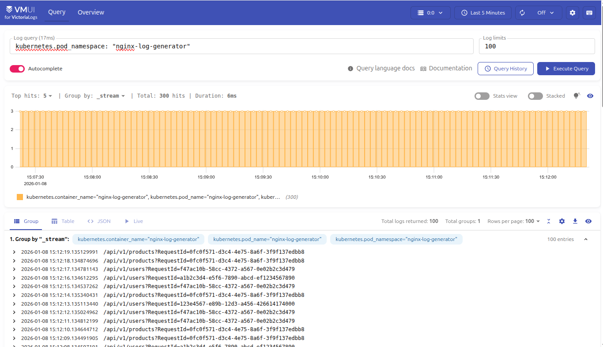

При раскрытии лога видим метаданные
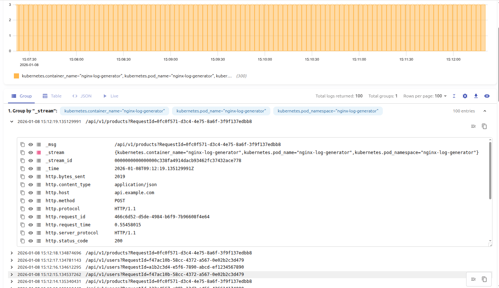


Используем mingrammer/flog для генерации логов
Содержимое flog-log-generator.yaml
```
apiVersion: apps/v1
kind: Deployment
metadata:
  name: flog-log-generator
  namespace: flog-log-generator
  labels:
    app: flog-log-generator
spec:
  replicas: 1
  selector:
    matchLabels:
      app: flog-log-generator
  template:
    metadata:
      labels:
        app: flog-log-generator
    spec:
      containers:
      - name: flog
        image: mingrammer/flog:latest
        args:
        - "--format"
        - "json"
        - "--loop"
        env:
        - name: LOG_LEVEL
          value: "info"
```


```bash
kubectl create ns flog-log-generator
kubectl apply -f flog-log-generator.yaml
```


Сырые логи в таком виде:
```
flog-log-generator-7b9df8d855-bt777 flog {"host":"86.89.148.235", "user-identifier":"-", "datetime":"08/Jan/2026:09:08:52 +0000", "method": "PATCH", "request": "/whiteboard", "protocol":"HTTP/2.0", "status":205, "bytes":29813, "referer": "http://www.humanintegrated.org/visualize/world-class/turn-key/out-of-the-box"}
```

В VMUI видно так
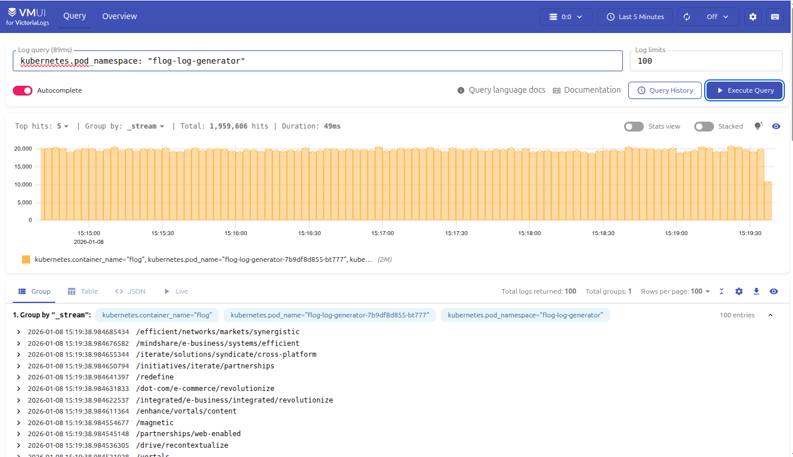

При раскрытии лога видим метаданные
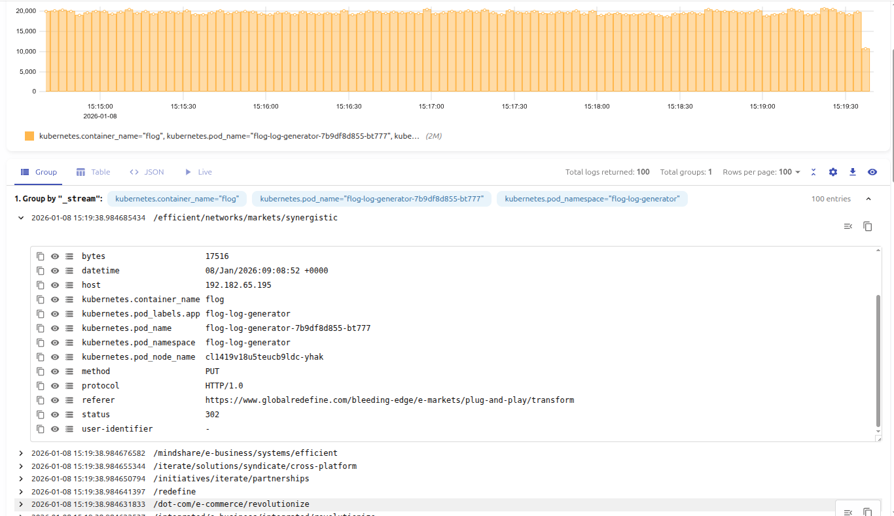


## Причина высокой производительности VictoriaLogs

VictoriaLogs достигает высокой производительности благодаря комбинации нескольких ключевых оптимизаций, которые работают вместе для минимизации использования дискового I/O и CPU при запросах к логам.

### Колоночное хранение каждого key

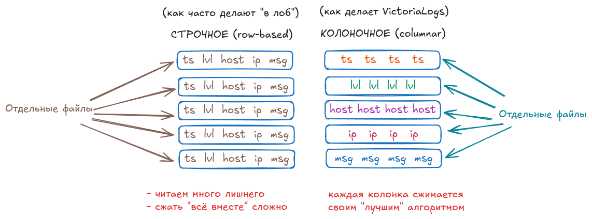

В отличие от традиционного построчного (row-oriented) хранения, где все поля одной записи хранятся вместе, VictoriaLogs использует колоночное (column-oriented) хранение. Каждый ключ (поле) хранится в отдельной колонке.

**Преимущества:**
- **Сжатие данных**: Одинаковые или похожие значения в одной колонке сжимаются гораздо эффективнее (например, повторяющиеся значения `status=200` или `method=GET`)
- **Быстрый доступ к конкретным полям**: При запросе только определенных полей система читает только нужные колонки, а не все данные записи
- **Векторизация операций**: Обработка данных колонка за колонкой позволяет эффективно использовать SIMD-инструкции процессора
- **Меньше данных на диске**: За счет лучшего сжатия уменьшается объем хранимых данных и ускоряется их чтение

### Читаем только нужные поля

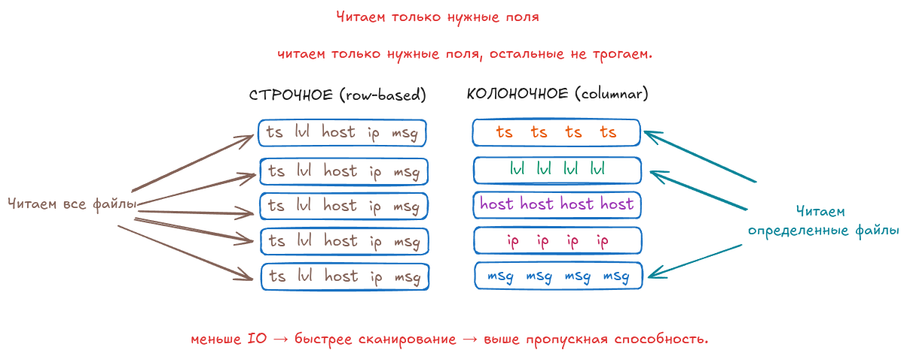

При выполнении запросов VictoriaLogs читает с диска только те колонки (поля), которые действительно нужны для ответа на запрос.

**Как это работает:**
- Если запрос фильтрует по полю `status` и возвращает только `message`, система читает только эти две колонки
- Остальные поля (например, `user_id`, `ip_address`, `timestamp`) остаются на диске нетронутыми
- Это критически важно для больших объемов данных, где разница между чтением 2 колонок и 20 колонок может быть в 10 раз

**Результат:**
- Снижение дискового I/O в 5-10 раз для типичных запросов
- Ускорение запросов за счет меньшего объема данных, которые нужно обработать
- Экономия памяти при обработке запросов

### Партиционирование по времени и потокам логов

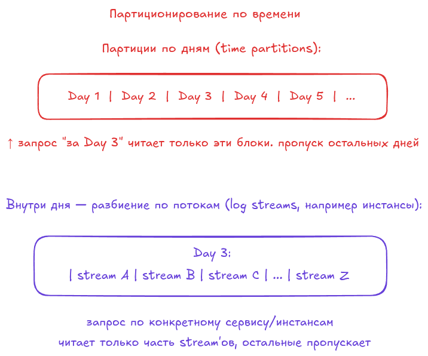

VictoriaLogs организует данные в партиции (части), разделенные по времени и потокам логов (log streams).

**Структура партиционирования:**
- **По времени**: Данные разбиваются на временные интервалы (например, по часам или дням)
- **По потокам**: Внутри временного интервала данные группируются по источникам логов (pod, namespace, application)

**Преимущества:**
- **Быстрый поиск по времени**: При запросе логов за определенный период система знает, какие партиции нужно открыть, и пропускает все остальные
- **Параллельная обработка**: Разные партиции могут обрабатываться параллельно на разных CPU ядрах
- **Эффективное удаление старых данных**: Устаревшие партиции можно удалить целиком, без сканирования всех данных
- **Локальность данных**: Логи одного приложения или сервиса хранятся рядом, что улучшает кэширование

**Пример:** При запросе логов за последний час система открывает только партиции за этот час, игнорируя данные за прошлые дни, недели и месяцы.

### Хранение связанных логов рядом

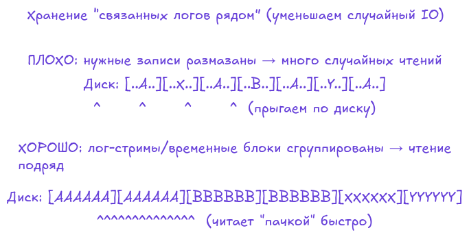

VictoriaLogs группирует логи, которые относятся к одному потоку (stream) или имеют общие характеристики, и хранит их физически рядом на диске.

**Что это дает:**
- **Локальность данных**: Логи одного приложения, одного pod'а или одного запроса хранятся в соседних блоках
- **Эффективное кэширование**: При чтении одного лога в кэш попадают связанные логи, которые, вероятно, понадобятся в следующих запросах
- **Меньше случайных чтений**: Вместо множества случайных обращений к диску система делает последовательные чтения блоков связанных данных
- **Быстрая трассировка**: Поиск всех логов, связанных с одним запросом становится быстрее

**Результат:** Снижение количества операций чтения с диска и улучшение использования кэша процессора и оперативной памяти.

### Bloom-фильтры: не открывай блок, если там точно нет нужного

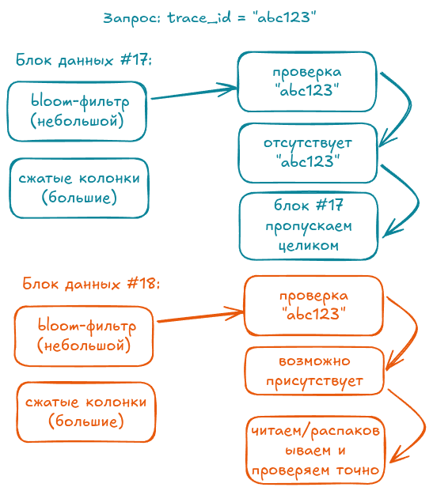

Bloom-фильтр — это вероятностная структура данных, которая позволяет быстро определить, **точно ли отсутствует** искомое значение в блоке данных.

**Как это работает:**
- Каждый блок данных имеет свой Bloom-фильтр, который содержит "отпечатки" всех значений в этом блоке
- Перед чтением блока система проверяет Bloom-фильтр
- Если фильтр говорит "значения точно нет" — блок пропускается без чтения
- Если фильтр говорит "возможно есть" — блок читается и проверяется детально

**Преимущества:**
- **Избежание ненужных чтений**: При поиске конкретного значения (например, `error_id=12345`) система пропускает блоки, где этого значения точно нет
- **Минимальные накладные расходы**: Bloom-фильтр занимает очень мало места (обычно несколько килобайт на блок)
- **Быстрая проверка**: Проверка фильтра занимает микросекунды, в то время как чтение блока с диска — миллисекунды

**Пример эффективности:** Если в системе 1000 блоков, и только в 10 из них есть искомое значение, Bloom-фильтры позволяют пропустить 990 блоков без чтения, сократив дисковый I/O в 100 раз.

### Синергия оптимизаций

Все эти техники работают вместе, создавая мультипликативный эффект:
- Партиционирование ограничивает область поиска
- Bloom-фильтры исключают ненужные блоки
- Колоночное хранение позволяет читать только нужные поля
- Хранение связанных логов рядом улучшает кэширование

В результате VictoriaLogs может обрабатывать запросы к терабайтам логов за миллисекунды, используя минимум ресурсов.


## Быстрый вход в LogsQL (cheatsheet)

LogsQL — pipeline-язык. Короткий набор базовых операций:

- Фильтр по времени: `_time:5m`, `_time:1h`, `_time:24h`
- Поиск слова: `"error"` или `"/api/v1/login"`
- Фильтр по полю: `http.status_code:>=400`, `kubernetes.pod_namespace:"nginx-log-generator"`
- Аггрегация: `| stats by (http.status_code) count() as requests`
- Извлечение: `| extract "duration=(\d+)"`
- Unpack JSON: `| unpack_json`
- Сортировка: `| sort by (requests desc)`
- Лимит: `| limit 10`
- `stats` — агрегации и функции (count, sum, avg, min, max, quantile, row_any и пр.).
- `extract` / `extract_regexp` — извлечение по регулярным выражениям.
- `unpack_json` / `unpack_logfmt` — развёртывание структурированных полей.
- `fields` — выбор столбцов для вывода.
- `sort`, `limit`, `filter`, `math` — постобработка.


Краткая структура запроса:

```
<filter> | <parsing/extract> | <transform> | <aggregation> | <post-filter>
```


## Руководство по LogsQL

### Содержание

1. [Фильтрация логов и временные фильтры](#1-фильтрация-логов-и-временные-фильтры)
2. [Примеры дашбордов / графиков](#2-примеры-дашбордов--графиков)
3. [LogsQL — язык запросов VictoriaLogs (кратко)](#3-logsql--язык-запросов-victorialogs-кратко)
4. [Операторы пайплайна (часто используемые)](#4-операторы-пайплайна-часто-используемые)
5. [Извлечение данных и парсинг](#5-извлечение-данных-и-парсинг)
6. [Агрегации и аналитика (stats)](#6-агрегации-и-аналитика-stats)
7. [Вычисления (math) и условия в агрегациях](#7-вычисления-math-и-условия-в-агрегациях)
8. [Практические паттерны](#8-практические-паттерны)
9. [Использование LogsQL в Grafana / VMUI](#9-использование-logsql-в-grafana--vmui)
10. [Cheatsheet (кратко)](#10-cheatsheet-кратко)
11. [Учебное пособие по LogsQL](#11-учебное-пособие-по-logsql)
12. [Советы по повышению производительности](#12-советы-по-повышению-производительности)
13. [Устранение неполадок (Troubleshooting)](#13-устранение-неполадок-troubleshooting)
14. [Справочник фильтров LogsQL](#14-справочник-фильтров-logsql)
15. [Справочник конвейеров (Pipes) LogsQL](#15-справочник-конвейеров-pipes-logsql)
16. [Справочник функций статистики (stats)](#16-справочник-функций-статистики-stats)


## 1. Фильтрация логов и временные фильтры

В LogsQL время обычно задаётся короткой формой `_time:<duration>` (например, `5m`, `1h`, `24h`). UI может подставлять временной фильтр автоматически.

Примеры:

```logsql
*             # время указывается в UI
```

```logsql
_time:5m      # последние 5 минут
_time:1h      # последний час
_time:24h     # последние сутки
```


## 2. Примеры дашбордов / графиков

1) Счётчики по статусам для namespace `nginx-log-generator` (за последние 5 минут):

```logsql
kubernetes.pod_namespace:"nginx-log-generator" | stats by (http.status_code) count() as requests | sort by (requests desc)
```

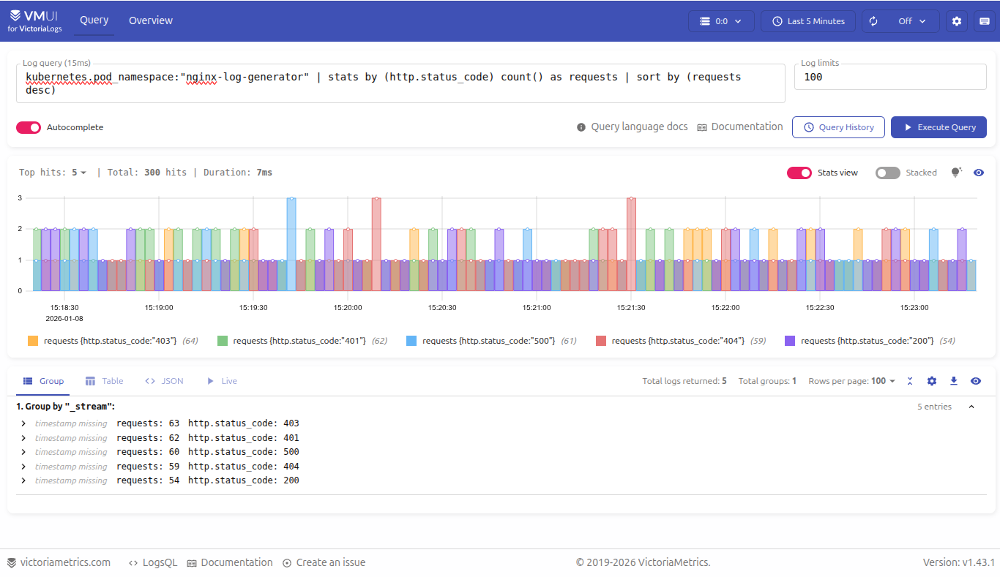

2) Топ медленных URL по времени ответа:

```logsql
kubernetes.pod_namespace:"nginx-log-generator" | stats by (http.url) max(http.request_time) as max_time | sort by (max_time desc) | limit 10
```
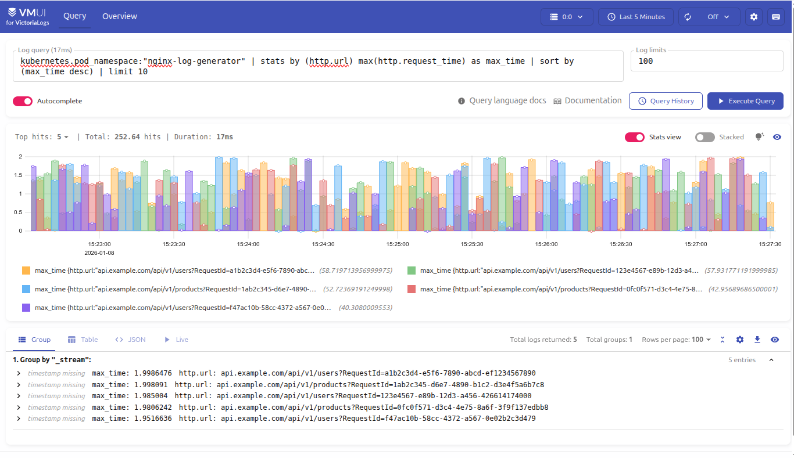

3) IP с наибольшим количеством ошибок (>=400):

```logsql
kubernetes.pod_namespace:"nginx-log-generator" | http.status_code:>=400 | stats by (nginx.remote_addr) count() as errors | sort by (errors desc) | limit 10
```

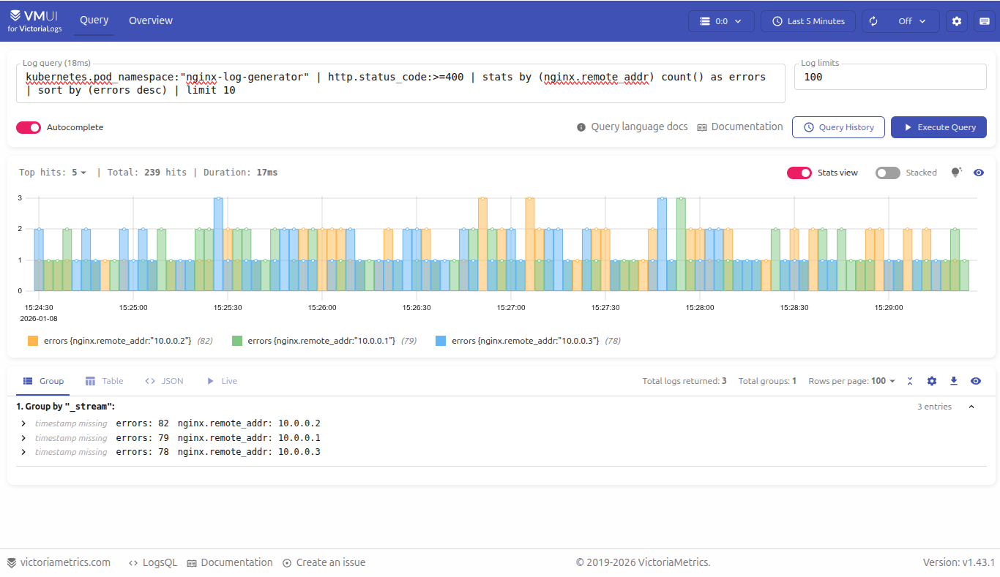

4) Доля ошибок (процент):

```logsql
kubernetes.pod_namespace:"nginx-log-generator" |
  stats count() as total, count() if (http.status_code:>=400) as errors |
  math errors / total * 100 as error_rate
```

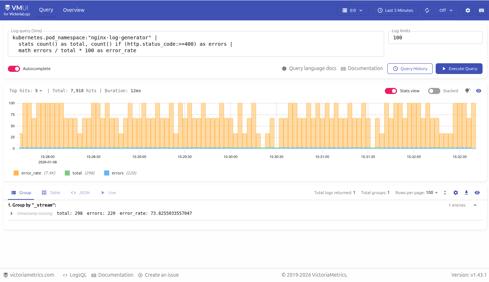


Для запроса ниже используем логи от самодельного приложения python-log-generator
```bash
kubectl create ns python-log-generator
kubectl apply -f python-log-generator.yaml
```

Содержимое python-log-generator.yaml
```

apiVersion: v1
kind: Pod
metadata:
  name: python-log-generator
  namespace: python-log-generator
  labels:
    app: python-log-generator
spec:
  containers:
  - name: python-log-generator
    image: antonpatsev/log-generator:2
```

5) Поиск подозрительных попыток подключения к БД (анализ аномалий):

```logsql
_time:1h "Failed to connect" | stats count() as attempts 
```

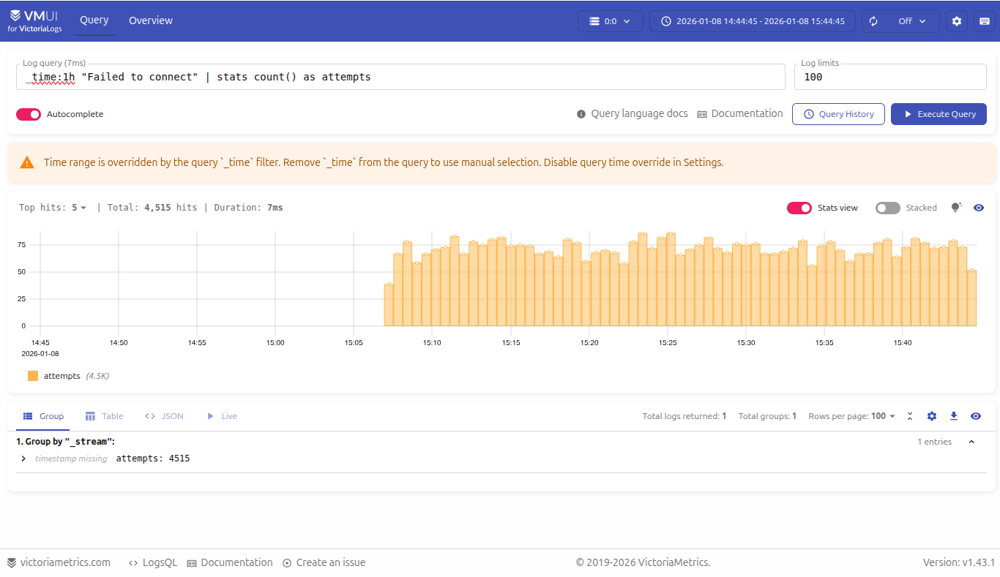


6) График распределения `status_code` по ручке `/api/v1/products` для `namespace nginx-log-generator`:

```logsql
kubernetes.pod_namespace:"nginx-log-generator" | "/api/v1/products" | stats by (http.status_code) count() as count
```

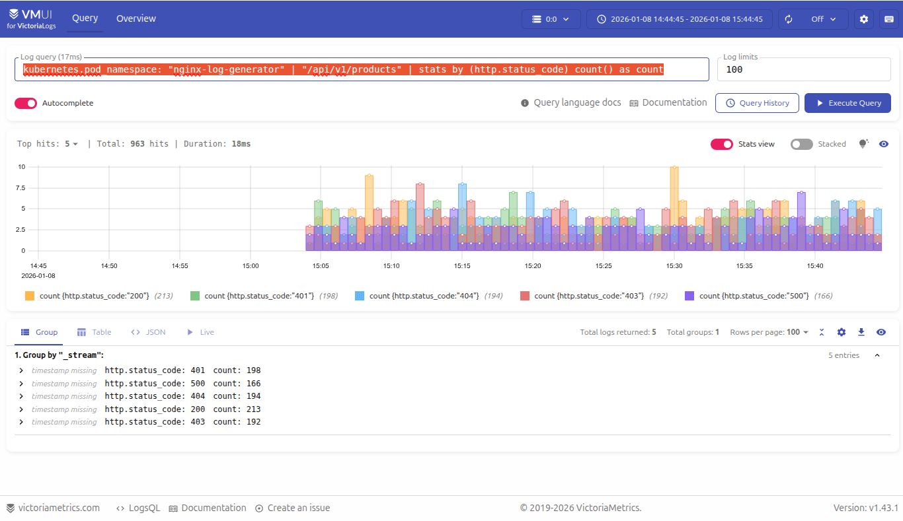


## 3. LogsQL — язык запросов VictoriaLogs (кратко)

LogsQL — потоковый (pipeline) язык запросов. Запрос состоит из последовательности стадий, разделённых `|`.

Общая структура:

```
<filtering> | <parsing/extract> | <transform> | <aggregation> | <post-filter>
```

### Примеры фильтров по полям

```logsql
http.status_code:200
http.status_code:>=400
http.method:GET
kubernetes.pod_namespace:"nginx-log-generator"
```

Поддерживаемые операторы сравнения: `=`, `!=`, `>`, `<`, `>=`, `<=`.

### Полнотекстовый поиск (full-text)

```logsql
"error"
"/api/v1/login"
"timeout exceeded"
```

Можно комбинировать с временным фильтром:

```logsql
_time:10m "error" kubernetes.pod_name:"nginx-log-generator"
```


## 4. Операторы пайплайна (часто используемые)

`filter` — пост-фильтрация результатов (обычно после `stats` или `math`):

```logsql
_time:10m | filter status:>=500
```

`fields` — выбор полей (аналог SELECT):

```logsql
_time:10m | fields _time, level, _msg, kubernetes.pod_name
```

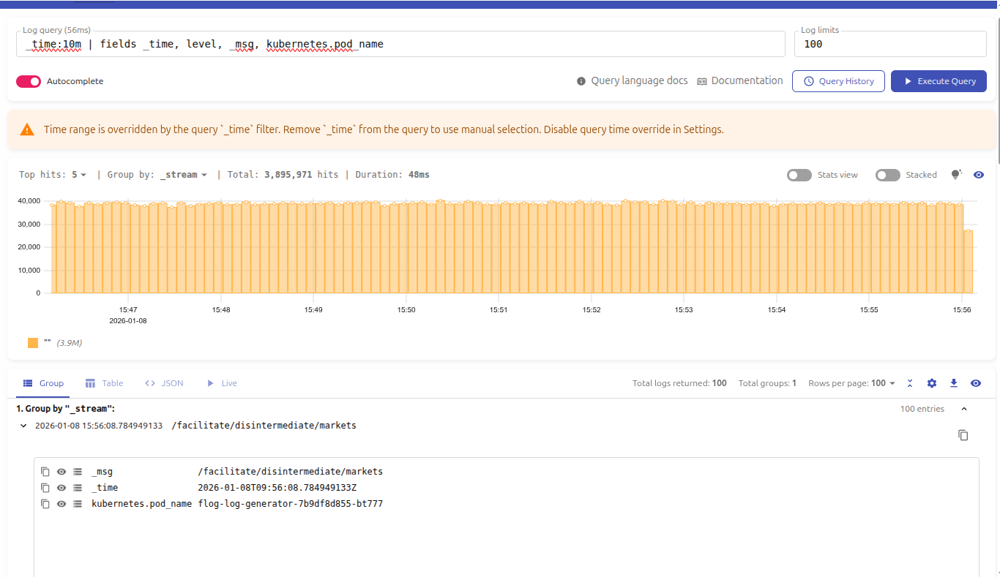

`sort` — сортировка:

```logsql
_time:10m | sort by (_time desc)
_time:10m | sort by (requests desc)
```

`limit` — ограничение количества строк:

```logsql
_time:10m | limit 10
_time:10m | sort by (errors desc) | limit 5
```


## 5. Извлечение данных и парсинг

`extract` — извлечение по шаблону с плейсхолдерами:

```logsql

# Извлечение RequestId из URL и группировка
_time:10m | extract "RequestId=<request_id>" from _msg | stats by (request_id) count() as hits
```

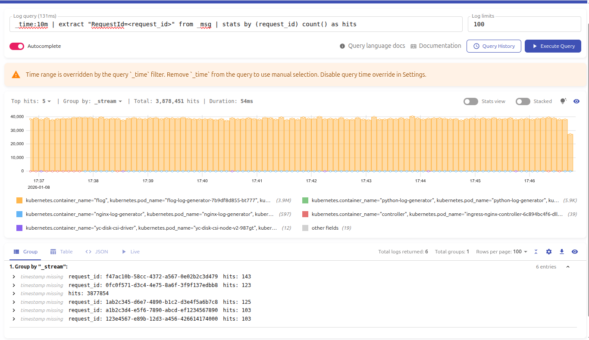

`extract_regexp` — извлечение по регулярному выражению с именованными группами:

```logsql
# Извлечение версии AppleWebKit из http.user_agent и топ по количеству
_time:10m | extract_regexp "AppleWebKit/(?P<webkit_version>[0-9.]+)" from http.user_agent | stats by (webkit_version) count() as hits | sort by (hits desc) | limit 10
```

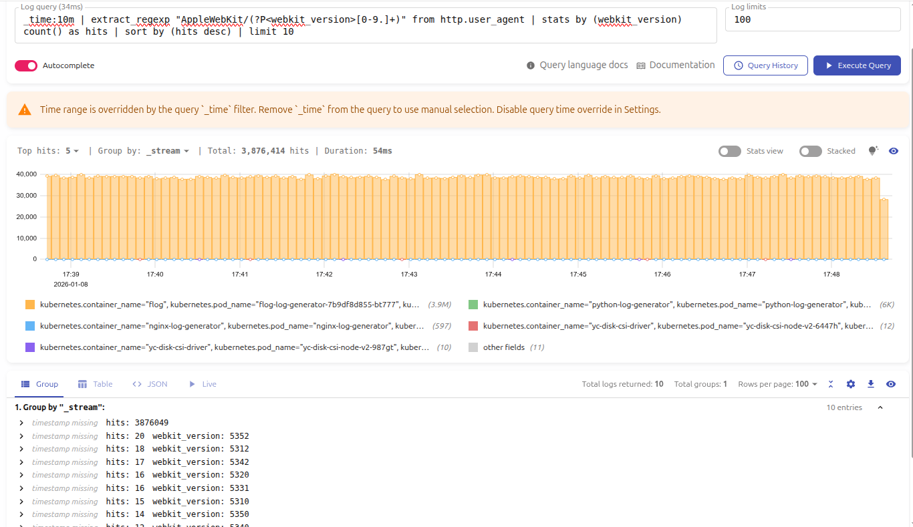

`unpack_json` — распаковка JSON-поля в отдельные поля:

```logsql
# Распаковка JSON и использование полей
_time:10m | unpack_json | filter level:"ERROR" | stats by (kubernetes.pod_name) count() as errors

# Распаковка и выбор конкретных полей для отображения
_time:10m | unpack_json | fields _time, level, message, kubernetes.pod_name, kubernetes.namespace
```

`unpack_logfmt`, `unpack_syslog` и другие — для соответствующих форматов.

`replace`, `replace_regexp`, `pack_json`, `pack_logfmt` — для трансформаций и упаковки.


## 6. Агрегации и аналитика (`stats`)

`stats` — основной оператор агрегации.

```logsql
_time:10m | stats by (status) count() as requests
```

Функции: `count()`, `sum(field)`, `avg(field)`, `min(field)`, `max(field)`, `quantile(0.95, field)`, `count_uniq()`, `row_any()` и т.д.

Примеры:

- Количество запросов по статусам:

```logsql
_time:5m | stats by (http.status_code) count() as requests
```

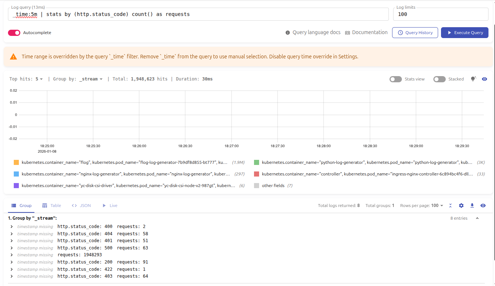

- Топ URL по трафику:

```logsql
_time:5m | stats by (http.url) sum(http.bytes_sent) as bytes | sort by (bytes desc) | limit 10
```

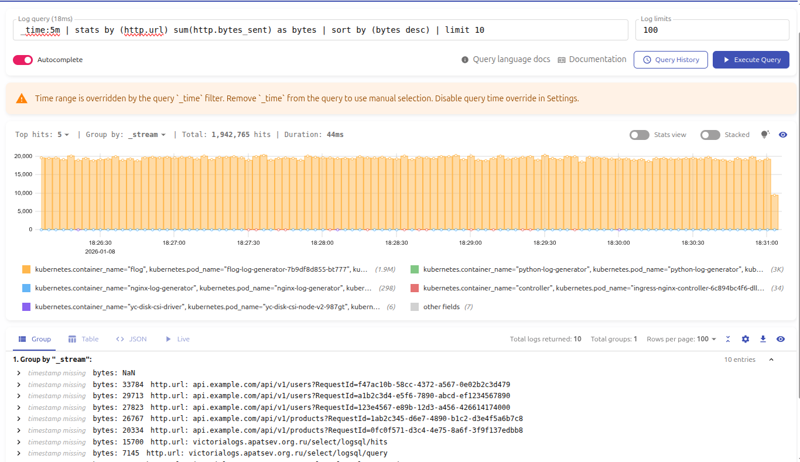

- P95 latency:

```logsql
_time:10m | stats quantile(0.95, request_time) as p95
```


## 7. Вычисления (`math`) и условия в агрегациях

`math` позволяет вычислять новые поля на основе существующих:

```logsql
_time:5m | math errors / total * 100 as error_rate
```

Условия внутри `stats` (через `if`):

```logsql
_time:5m | stats count() if (level:"ERROR") as error_count
```

Пример расчёта процента ошибок:

```logsql
kubernetes.pod_namespace:"nginx-log-generator" |
stats
  count() as total,
  count() if (http.status_code:>=400) as errors |
math errors / total * 100 as error_rate
```


## 8. Практические паттерны

- Топ IP с ошибками:

```logsql
_time:10m http.status_code:>=400 |
stats by (remote_addr) count() as errors |
sort by (errors desc) |
limit 10
```

- Медленные запросы:

```logsql
_time:5m |
stats by (http.url) max(request_time) as max_time |
sort by (max_time desc) |
limit 5
```

- Поиск аномалий (много попыток входа):

```logsql
_time:1h "failed login" |
stats by (user, ip) count() as attempts |
filter attempts:>20
```


## 9. Использование LogsQL в Grafana / VMUI

LogsQL поддерживается в VictoriaLogs datasource для Grafana и в VMUI:

- построение time-series графиков;
- таблицы с агрегациями;
- алерты на основе логов;
- единый язык запросов для VMUI и Grafana.


## 10. Cheatsheet (кратко)

| Операция          | Пример                       |
|-------------------|------------------------------|
| Фильтр по времени | `_time:5m`                   |
| Поиск строки      | `"error"`                    |
| Фильтр поля       | `status:>=500`               |
| JSON / распаковка | `unpack_json`                |
| Regex extract     | `extract "id=(\d+)"`         |
| Агрегация         | `stats by (status) count()`  |
| Сортировка        | `sort by (count desc)`       |
| Ограничение       | `limit 10`                   |
| Вычисление        | `math a / b * 100 as pct`    |


## 11. Учебное пособие по LogsQL

### Основы запросов LogsQL

Самый простой запрос — слово, которое нужно найти в сообщении лога (поле `_msg`). Для выполнения запросов рекомендуется использовать утилиту `vlogscli`.

**Примеры:**

```logsql
error
"and"
"error: cannot find file"
```

### Фильтр по времени

Рекомендуется добавлять фильтр по времени для ограничения поиска.

**Примеры:**

```logsql
error AND _time:5m
_time:5m error
```

### Сортировка и ограничение результатов

**Примеры:**

```logsql
_time:5m error | sort by (_time)
_time:5m error | sort by (_time) desc | limit 10
```

### Выбор полей

**Примеры:**

```logsql
error _time:5m | fields _time, _stream, _msg
```

### Исключение записей

**Примеры:**

```logsql
_time:5m error NOT buggy_app
_time:5m error -buggy_app
_time:5m error -(buggy_app OR foobar)
```

### Запросы по полям

**Примеры:**

```logsql
_time:5m log.level:error -(buggy_app OR foobar)
_time:5m log.level:error -app:(buggy_app OR foobar)
```

### Оптимизация запросов

Используйте фильтр по потокам для повышения производительности:

```logsql
_time:5m log.level:error {app!~"buggy_app|foobar"}
```

### Статистические функции

**Примеры:**

```logsql
_time:5m error | stats count() logs_with_error
```

### Ключевые понятия

**Слово (Word):** LogsQL разбивает все поля лога на слова, разделённые небуквенными символами. Слова могут содержать любые символы UTF‑8.


## 12. Советы по повышению производительности

- **Обязательно указывайте фильтр по времени** (time filter), чтобы ограничить поиск конкретным временным диапазоном.
- **Обязательно указывайте фильтр по потокам** (stream filter), чтобы сузить поиск до конкретных потоков логов.
- **Указывайте нужные поля логов** в результатах запроса с помощью оператора `fields`, если выбранные записи содержат много полей, которые вам не интересны.
- **Размещайте более быстрые фильтры** (например, фильтр по слову и фильтр по фразе) **в начале запроса**. Это правило не относится к фильтрам по времени и по потокам.
- **Ставьте в начало запроса более специфичные фильтры**, которые отбирают меньшее число записей логов.
- **Старайтесь сократить число отобранных логов** за счёт более точных фильтров, возвращающих меньше записей для обработки операторами.
- **Если логи хранятся в системах хранения с высокой задержкой** (например, NFS или S3), **увеличьте число параллельных читателей** через параметр `parallel_readers`.


## 13. Устранение неполадок (Troubleshooting)

Самая частая причина медленных запросов — запрос слишком большого количества логов без достаточной фильтрации. Всегда **будьте максимально конкретны** при построении запросов.

### Проверьте, сколько логов соответствует вашему запросу

Добавляйте `| count()` после каждого фильтра или pipe, чтобы увидеть количество совпадающих логов.

**Примеры:**

```logsql
_time:5m host:"api-" level:error "database" | count()
_time:5m level:error | count()
_time:5m host:"api-" | count()
```

Фильтр `_time` является обязательным: если его нет, VictoriaLogs сканирует **все** логи, хранящиеся в базе данных.

### Проверяйте использование stream-фильтров в запросе

Используйте правильный синтаксис stream-фильтров:

```logsql
{app="nginx"}
```

Вместо:

```logsql
app:=nginx
```

### Проверьте количество уникальных log stream'ов

**Примеры:**

```logsql
_time:1d | stats count_uniq(_stream) as streams
_time:1d | top 10 by (_stream)
_time:1d {app="nginx"} | stats count_uniq(_stream) as streams, count() as logs
```

### Определите самые «дорогие» части запроса

Используйте `block_stats` для анализа:

```logsql
_time:1d | keep kubernetes.pod_name, kubernetes.pod_namespace | block_stats
_time:1d | keep kubernetes.pod_name, kubernetes.pod_namespace | block_stats | stats by (field) sum(values_bytes) values_bytes_on_disk, sum(rows) rows | sort by (values_bytes_on_disk) desc
```

### Профилируйте pipes поэтапно

Добавляйте фильтры и pipes по одному, измеряя производительность:

```logsql
_time:5m | count()
_time:5m error | count()
_time:5m error -"cannot open file" | count()
_time:5m error contains_any("access denied", "unauthorized", "403") | count()
```

**Рекомендации по оптимизации:**

- Сопоставление по regex и парсинг JSON — дорогие операции. Используйте более быстрые альтернативы.
- Сортировка без ограничения (`sort` без `limit`) сохраняет все логи в памяти. Добавьте `limit` или уменьшите входной объём данных.
- Функции с высокой кардинальностью, такие как `count_uniq()`, хранят в памяти все уникальные значения.
- Большое число групп в `stats by (...)` может потреблять много памяти.


## 14. Справочник фильтров LogsQL

### Фильтр «любое значение»

Находит записи журнала, содержащие любое непустое значение для заданного поля.

**Примеры:**

```logsql
log_field:*
"some:field":*
```

### Регистронезависимый фильтр

Применяется к любому слову, фразе или префиксу, обернув соответствующий фильтр в `i()`.

**Примеры:**

```logsql
i(error)
i("ssh: login fail")
i(err*)
```

### Фильтр `contains_all`

Находит логи, которые содержат все заданные слова/фразы. Эквивалентно `v1 AND v2 ... AND vN`.

**Примеры:**

```logsql
contains_all(foo, "bar baz")
contains_all(error, file, app)
```

### Фильтр `contains_any`

Находит логи, которые содержат хотя бы одно слово или фразу из множества. Эквивалентно `v1 OR v2 OR ... OR vN`.

**Примеры:**

```logsql
contains_any(foo, "bar baz")
contains_any(error, warning, info)
```

### Фильтр contains_common_case

Ищет логи, в которых поле содержит заданные фразы, учитывая различные варианты регистра (обычно быстрее, чем `i(...)`).

**Примеры:**

```logsql
_msg:contains_common_case("VictoriaMetrics")
```

### Фильтр дневного диапазона

Выбирает логи в интервале времени каждый день. Границы: `[`/`]` — включить, `(`/`)` — исключить.

**Примеры:**

```logsql
_time:day_range[08:00, 18:00)
_time:day_range(08:00, 18:00]
_time:day_range[08:00, 18:00) offset 2h # Указание часового пояса UTC+2:
```

### Фильтр пустого значения

Находит записи логов без указанного поля.

**Примеры:**

```logsql
host.hostname:""
```

### Фильтр eq_field

Находит логи, которые содержат одинаковые значения в заданных полях.

**Примеры:**
Например, следующий запрос находит логи с одинаковыми значениями в полях `user_id` и `customer_id`:

```logsql
user_id:eq_field(customer_id)
NOT user_id:eq_field(customer_id)
```

### Фильтр equals_common_case

Ищет логи, в которых поле равно заданным фразам, учитывая различные варианты регистра (обычно быстрее, чем `i(...)`).

**Примеры:**

```logsql
_msg:equals_common_case("VictoriaMetrics")
```

### Фильтр точного совпадения (`exact`)

Ищет строгое совпадение значения без лишнего текста. Чувствителен к регистру (для нечувствительного — `i(...)`). По умолчанию применяется к полю `_msg`.

**Примеры:**

```logsql
="fatal error" # — только точное сообщение в поле **`_msg`**.
log.level:="error" # точное значение в поле log.level
```

### Фильтр точного префикса

Ищет логи, начинающиеся с заданного префикса. Чувствителен к регистру и позиции (только начало строки). По умолчанию применяется к полю `_msg`.

**Примеры:**

```logsql
="префикс"*
field:="префикс"*
"log:level":="err"*
```

### Фильтр диапазонов IPv4

Фильтрует сообщения журнала по полю, содержащему только IPv4-адреса. Поддерживает CIDR-нотацию.

**Примеры:**

```logsql
user.ip:ipv4_range(127.0.0.0, 127.255.255.255)
user.ip:ipv4_range("127.0.0.0/8")
```

### Фильтр le_field

Находит логи, в которых значение одного поля не превышает значение другого поля.

**Примеры:**
Например, следующий запрос отбирает логи, в которых значение поля `duration` не превышает значения поля `max_duration`:

```logsql
duration:le_field(max_duration)
NOT duration:le_field(max_duration)
```

### Фильтр по диапазону длины

Фильтрует сообщения журнала по их длине. По умолчанию применяется к полю `_msg`.

**Примеры:**

```logsql
len_range(5, 10)
len_range(5, inf)
len_range(1_000, 2_345_678)
foo:len_range(10, 20)
```

### Логический фильтр

Объединяет базовые фильтры с помощью логических операций: `AND`, `OR`, `NOT` (или `-`, `!`). Приоритет: `NOT` > `AND` > `OR`. Можно использовать скобки для изменения порядка.

**Примеры:**

```logsql
error AND file AND app
error file app
error OR warning OR info
NOT info
-info
log.level:(error OR warning OR info)
NOT (info OR debug)
```

### Фильтр lt_field

Отбирает записи, где значение первого поля строго меньше значения второго поля.

**Примеры:**

```logsql
duration:lt_field(max_duration)
NOT duration:lt_field(max_duration)
```

### Фильтр множественного точного совпадения

Находит сообщения журнала, в которых определённое поле содержит одно из заданных значений. Используйте `in()`.

**Примеры:**

```logsql
log.level:in("error", "fatal")
log.level:(="error" OR ="fatal")
```

### Фильтр сопоставления с шаблоном

Фильтрует логи по шаблонам с плейсхолдерами: `<N>` (число), `<UUID>`, `<IP4>`, `<TIME>`, `<DATE>`, `<DATETIME>`, `<W>` (слово). По умолчанию применяется к полю `_msg`.

**Примеры:**

```logsql
pattern_match("user_id=<N>, ip=<IP4>, time=<DATETIME>")
pattern_match_full("шаблон")
поле_лога:pattern_match("шаблон")
```

### Фильтр по фразе

Находит сообщения логов, содержащие определённую фразу. Заключите фразу в кавычки. Фраза может включать любые символы (пробелы, знаки препинания и т.д.). По умолчанию ищется в поле `_msg`.

**Примеры:**

```logsql
"ssh: login fail"
'"foo":"bar"'
event.original:"cannot open file"
"some:message":"cannot open file"
```

### Фильтр по префиксу

Находит сообщения логов, содержащие слова/фразы с определённым префиксом. Добавьте символ `*` в конец слова/фразы. По умолчанию применяется к полю `_msg`.

**Примеры:**

```logsql
err*
"unexpected fail"*
log.level:err*
"log:level":err*
```

### Фильтр сравнения диапазонов

Поддерживает фильтры вида `field:>X`, `field:>=X`, `field:<X` и `field:<=X`, где `X` — числовое значение, IPv4-адрес или строка.

**Примеры:**

```logsql
response_size:>10KiB
username:<"John"
```

### Фильтр диапазона

Фильтрует сообщения журнала по полю, содержащему только числовые значения. Границы по умолчанию исключаются (используйте квадратные скобки для включения).

**Примеры:**

```logsql
request.duration:range(4.2, Inf)
request.duration:range[1, 10]
request.duration:>4.2
```

### Фильтр по регулярным выражениям

Поддерживает фильтрацию по регулярным выражениям (синтаксис RE2) через конструкцию `~"regex"`. По умолчанию применяется к полю `_msg`.

**Примеры:**

```logsql
~"err|warn"
~"(?i)(err|warn)"
~'"foo":"(bar|baz)"'
~"a\\.b"
event.original:~"err|warn"
"event:original":~"err|warn"
```

### Фильтр последовательности

Находит сообщения логов, в которых слова или фразы идут в определённом порядке. По умолчанию применяется к полю `_msg`.

**Примеры:**

```logsql
seq("error", "open file")
event.original:seq(error, "open file")
"event:original":seq(error, "open file")
```

### Фильтр потоков

Оптимизированный способ выбора логов по потокам с помощью селектора меток Prometheus `{...}`.

**Примеры:**

```logsql
{app="nginx"}
{app in ("nginx", "foo.bar")}
{app not_in ("nginx", "foo.bar")}
_stream:{app="nginx"}
```

### Фильтр диапазона строк

Фильтрует сообщения журнала по полю со строковыми значениями в определённом диапазоне. Включает нижнюю границу, исключает верхнюю.

**Примеры:**

```logsql
user.name:string_range(A, C)
user.name:string_range(C, E)
```

### Фильтр с подзапросом

Отбирает логи, в которых значения полей совпадают со значениями, полученными в результате подзапроса. Подзапрос должен завершаться конвейером `fields` или `uniq` с одним полем.

**Примеры:**

```logsql
_time:5m AND user_id:in(_time:1d AND path:admin | fields user_id)
_time:5m _msg:contains_all(_time:1d is_admin:true | fields user_id)
_time:5m _msg:contains_any(_time:1d is_admin:true | fields user_id)
```

### Фильтр по подстроке

Находит логи, содержащие определённую подстроку. Используйте `*подстрока*`. По умолчанию применяется к полю `_msg`.

**Примеры:**

```logsql
*ampl*
~"(?i)ampl"
```

### Фильтр по времени

Сужает область поиска по времени. Рекомендуется использовать для оптимизации запросов.

**Примеры:**

```logsql
_time:1h AND error
_time:5m
_time:2.5d15m42.345s
_time:2023-04-25Z
_time:[2023-04-01Z, 2023-04-30Z]
_time:5m offset 1h
_time:2023-04-25+05:30
_time:>2023-04-01Z
_time:<=2023-04-30Z
```

### Фильтр value_type

Выбирает логи с полями определённого типа значения (например, `uint64`, `int64`, `float64`, `string`, `dict`, `const`).

**Примеры:**

```logsql
user_id:value_type(uint64)
```

### Фильтр диапазона дней недели

Фильтрует логи по дням недели. Дни: `Sun/Sunday`, `Mon/Monday`, ..., `Sat/Saturday`. Границы: `[`/`]` — включить, `(`/`)` — исключить.

**Примеры:**

```logsql
_time:week_range[Mon, Fri]
_time:week_range(Sun, Sat)
_time:week_range[Mon, Fri] offset 2h
_time:week_range[Mon, Fri] _time:day_range(08:00, 18:00)
```

### Фильтр по слову

Запрос из одного слова ищет это слово в поле `_msg`. Соответствует строкам, содержащим точное совпадение слова. Поиск чувствителен к регистру (без регистра: `i(error)`).

**Примеры:**

```logsql
error
log.level:error
"ip:remote":"1.2.3.45"
```


## 15. Справочник конвейеров (Pipes) LogsQL

### Конвейер collapse_nums

Заменяет все десятичные и шестнадцатеричные числа в указанном поле на заполнитель `<N>`. Если применяется к `_msg`, суффикс `at ...` можно опустить. Поддерживает `prettify` для распознавания шаблонов (UUID, IP4, TIME, DATE, DATETIME), условное применение `if (...)`.

**Примеры:**

```logsql
_time:5m | collapse_nums at _msg
_time:5m | collapse_nums
_time:1h | collapse_nums | top 5 by (_msg)
_time:1h | collapse_nums prettify
_time:5m | collapse_nums if (user_type:=admin) at foo
```

### Удалить поля (delete pipe)

Удаляет указанные поля из логов. Можно использовать `drop`, `del`, `rm` вместо `delete`. Поддерживает удаление полей с общим префиксом.

**Примеры:**

```logsql
_time:5m | delete host, app
_time:5m | drop host
_time:5m | delete foo*
```

### Конвейер drop_empty_fields

Удаляет поля с пустыми значениями из результатов. Пропускает записи журнала, в которых нет ни одного непустого поля.

**Примеры:**

```logsql
_time:5m | extract 'email: <email>,' from foo | drop_empty_fields
```

### Конвейер extract_regexp

Извлекает подстроки из поля согласно регулярному выражению RE2 с именованными группами `(?P<capture_field_name>...)`. Если применяется к `_msg`, часть `from _msg` можно опустить.

**Примеры:**

```logsql
# Базовое извлечение IP-адреса
_time:5m | extract_regexp "(?P<ip>([0-9]+[.]){3}[0-9]+)" from _msg

# Извлечение IP и статистика по IP-адресам
_time:5m | extract_regexp "(?P<ip>([0-9]+[.]){3}[0-9]+)" from _msg | stats by (ip) count() as requests | sort by (requests desc) | limit 10

# Извлечение нескольких полей и использование в запросе
_time:5m | extract_regexp 'status=(?P<status>\d+).*time=(?P<response_time>[\d.]+)' from _msg | filter response_time:>1.0 | stats by (status) avg(response_time) as avg_time

# Извлечение с сохранением оригинальных полей
_time:5m | extract_regexp 'ip=(?P<ip>([0-9]+[.]){3}[0-9]+)' keep_original_fields | fields _time, ip, _msg

# Извлечение из другого поля
_time:5m | extract_regexp 'ip=(?P<ip>([0-9]+[.]){3}[0-9]+)' from foo skip_empty_results | filter ip:* | fields ip, foo

# Условное извлечение
_time:5m | extract_regexp if (ip:"") "ip=(?P<ip>([0-9]+[.]){3}[0-9]+)" | fields _time, ip

# Извлечение RequestId и группировка
_time:10m | extract_regexp 'RequestId=(?P<request_id>[a-f0-9\-]+)' from _msg | stats by (request_id) count() as hits | sort by (hits desc)
```

**Использование извлеченных переменных:**
- Именованные группы `(?P<имя>...)` создают поля с соответствующими именами
- Извлеченные поля можно использовать в последующих операторах:
  - `stats by (извлеченное_поле)` — группировка
  - `filter извлеченное_поле:значение` — фильтрация
  - `sort by (извлеченное_поле)` — сортировка
  - `fields извлеченное_поле` — выбор для отображения
  - `math` — вычисления с извлеченными числовыми полями

### Оператор extract (извлечение данных)

Извлекает текст из указанного поля и сохраняет в новые поля согласно шаблону. Существующие поля не изменяются. Если применяется к `_msg`, часть `from _msg` можно опустить.

**Примеры:**

```logsql
# Базовое извлечение IP и топ по частоте
_time:1d error | extract "ip=<ip> " from _msg | top 10 (ip)

# Извлечение и использование в статистике
_time:1d error | extract "ip=<ip> " from _msg | stats by (ip) count() as errors | sort by (errors desc) | limit 10

# Извлечение нескольких полей и отображение
_time:1d error | extract "ip=<ip> user=<user> " from _msg | fields _time, ip, user, _msg

# Извлечение из JSON-формата
_time:5m | extract '"ip":"<ip>"' | filter ip:* | stats by (ip) count() as requests

# Извлечение с сохранением оригинальных полей
_time:5m | extract 'ip=<ip> ' keep_original_fields | fields _time, ip, _msg

# Извлечение из другого поля
_time:5m | extract 'ip=<ip> ' from foo skip_empty_results | filter ip:* | fields ip, foo

# Условное извлечение (только если поле ip пустое)
_time:5m | extract if (ip:"") "ip=<ip> " | fields _time, ip, _msg
```

**Использование извлеченных переменных:**
- После извлечения поля доступны как обычные поля лога
- Можно использовать в `stats by (извлеченное_поле)`
- Можно фильтровать: `filter извлеченное_поле:значение`
- Можно сортировать: `sort by (извлеченное_поле desc)`
- Можно отображать: `fields извлеченное_поле`

**Плейсхолдеры:** `<поле>` — именованный, `<_>` — анонимный, `plain:` — отключение удаления кавычек.

### Конвейер facets

Возвращает наиболее частые значения для каждого встреченного поля лога и оценку числа попаданий. Поддерживает `facets N`, `max_values_per_field M`, `max_value_len K`, `keep_const_fields`.

**Примеры:**

```logsql
_time:1h error | facets
_time:1h error | facets 3
_time:1h error | facets 15 max_values_per_field 100000
_time:1h error | facets max_value_len 100
_time:1h error | facets keep_const_fields
```

### Конвейер field_names

Возвращает все имена полей логов вместе с оценочным количеством записей логов для каждого имени поля.

**Примеры:**

```logsql
_time:5m | field_names
```

### Конвейер field_values

Возвращает все значения для указанного поля вместе с количеством логов для каждого значения. Поддерживает `limit N`.

**Примеры:**

```logsql
_time:5m | field_values level
_time:5m | field_values user_id limit 10
```

### Конвейер fields (выбор полей)

Выбирает конкретный набор полей лога. Можно использовать `keep` вместо `fields`. Поддерживает шаблоны с подстановкой.

**Примеры:**

```logsql
_time:5m | fields host, _msg
_time:5m | keep host, _msg
_time:5m | fields foo*
```

### Конвейер фильтрации (filter pipe)

Фильтрует логи с помощью указанного фильтра. Можно использовать `where` вместо `filter`. Префикс `filter` можно опустить, если фильтры не конфликтуют с названиями конвейеров.

**Примеры:**

```logsql
_time:1h error | stats by (host) count() logs_count | filter logs_count:> 1_000
_time:1h error | stats by (host) count() logs_count | where logs_count:> 1_000
_time:1h error | stats by (host) count() logs_count | logs_count:> 1_000
```

### Конвейер first

Возвращает первые N записей журнала после сортировки по указанным полям. Поддерживает `partition by` для группировки.

**Примеры:**

```logsql
_time:5m | first 10 by (request_duration)
_time:1h | first 3 by (request_duration) partition by (host)
```

### Труба format (format pipe)

Объединяет поля логов согласно шаблону и сохраняет результат в поле. Если результат сохраняется в `_msg`, часть `as _msg` можно опустить. Поддерживает префиксы: `duration_seconds:`, `q:`, `uc:`, `lc:`, `urlencode:`, `urldecode:`, `hexencode:`, `hexdecode:`, `base64encode:`, `base64decode:`, `hexnumdecode:`, `time:`, `duration:`, `ipv4:`, `hexnumencode:`. Поддерживает `keep_original_fields`, `skip_empty_results`, условное форматирование `if (...)`.

**Примеры:**

```logsql
_time:5m | format "request from <ip>:<port>" as _msg
_time:5m | format "request from <ip>:<port>"
_time:5m | format '{"_msg":<q:_msg>,"stacktrace":<q:stacktrace>}' as my_json
_time:5m | format 'uppercase foo: <uc:foo>, lowercase bar: <lc:bar>' as result
_time:5m | format 'url: http://foo.com/?user=<urlencode:user>'
_time:5m | format if (ip:* and host:*) "request from <ip>:<host>" as message
```

### Конвейер generate_sequence

Пропускает все результаты запроса и генерирует N выходных логов с полем `_msg`, содержащим целочисленную последовательность от 0 до N-1. Полезен для тестирования и отладки.

**Примеры:**

```logsql
* | generate_sequence 1000 | math round(rand()*10) as rand_num | stats by (rand_num) count() hits | sort by (rand_num)
```

### Конвейер hash

Вычисляет хеш-значение для указанного поля и сохраняет его в новое поле.

**Примеры:**

```logsql
_time:5m | hash(user_id) as user_id_hash
```

### Труба join (соединение)

Соединяет результаты первого запроса с результатами второго по заданному набору полей. Работает как `LEFT JOIN` в SQL. Поддерживает `inner` для `INNER JOIN`, `prefix` для добавления префикса к полям.

**Примеры:**

```logsql
_time:1d {app="app1"} | stats by (user) count() app1_hits | join by (user) (_time:1d {app="app2"} | stats by (user) count() app2_hits)
_time:1d {app="app1"} | stats by (user) count() app1_hits | join by (user) (_time:1d {app="app2"} | stats by (user) count() app2_hits) inner
_time:1d {app="app1"} | stats by (user) count() app1_hits | join by (user) (_time:1d {app="app2"} | stats by (user) count() app2_hits) prefix "app2."
```

### Конвейер json_array_len

Вычисляет длину JSON-массива в указанном поле и сохраняет результат в новое поле.

**Примеры:**

```logsql
_time:5m | unpack_words _msg as words | json_array_len(words) as words_count | first 5 (words_count desc)
```

### Последний конвейер (last pipe)

Возвращает последние N записей журнала после сортировки по указанным полям. Поддерживает `partition by` для группировки.

**Примеры:**

```logsql
_time:5m | last 10 by (request_duration)
_time:1h | last 3 by (request_duration) partition by (host)
```

### len (длина) — конвейер

Сохраняет длину в байтах значения указанного поля в новое поле.

**Примеры:**

```logsql
_time:5m | len(_msg) as msg_len | sort by (msg_len desc) | limit 5
```

### Ограничение вывода (limit pipe)

Ограничивает количество возвращаемых логов. Можно использовать `head` вместо `limit`. По умолчанию строки выбираются в произвольном порядке.

**Примеры:**

```logsql
_time:5m | limit 100
_time:5m | head 100
error | head
```

### Конвейер math (математические вычисления)

Выполняет математические вычисления над числовыми значениями полей. Поддерживает операции: `+`, `-`, `*`, `/`, `%`, `^`, `&`, `or`, `xor`, `default`, функции: `abs`, `ceil`, `exp`, `floor`, `ln`, `max`, `min`, `now()`, `rand()`, `round`. Можно использовать `eval` вместо `math`.

**Примеры:**

```logsql
_time:5m | math round(duration_msecs / 1000) as duration_secs
_time:5m | eval (duration_secs * 1000) as duration_msecs
_time:5m | math round(request_duration, 1e9) as request_duration_nsecs | format '<duration:request_duration_nsecs>' as request_duration
```

### Труба offset (пропуск записей)

Пропускает указанное количество записей после сортировки. Можно использовать `skip` вместо `offset`. Рекомендуется использовать после `sort`.

**Примеры:**

```logsql
_time:5m | sort by (_time) | offset 100
_time:5m | skip 10
```

### Конвейер pack_json

Упаковывает все поля записи журнала в объект JSON и сохраняет в виде строки. Если результат сохраняется в `_msg`, часть `as _msg` можно опустить. Поддерживает `fields (...)` для выбора полей.

**Примеры:**

```logsql
_time:5m | pack_json as _msg
_time:5m | pack_json
_time:5m | pack_json fields (foo, bar) as baz
_time:5m | pack_json fields (foo.*, bar.*) as baz
_time:5m | pack_json as foo | fields foo
```

### Конвейер pack_logfmt

Упаковывает все поля записи журнала в сообщение формата logfmt и сохраняет в виде строки. Если результат сохраняется в `_msg`, часть `as _msg` можно опустить. Поддерживает `fields (...)` для выбора полей.

**Примеры:**

```logsql
_time:5m | pack_logfmt as _msg
_time:5m | pack_logfmt
_time:5m | pack_logfmt fields (foo, bar) as baz
_time:5m | pack_logfmt fields (foo.*, bar.*) as baz
_time:5m | pack_logfmt as foo | fields foo
```

### Конвейер query_stats

Возвращает статистику выполнения запроса: `BytesReadColumnsHeaders`, `BytesReadValues`, `BytesReadTotal`, `BlocksProcessed`, `RowsProcessed`, `RowsFound`, `ValuesRead`, `QueryDurationNsecs` и другие метрики. Полезен для анализа и оптимизации медленных запросов.

### Конвейер replace_regexp

Заменяет подстроки, соответствующие регулярному выражению RE2, на строку замены. В строке замены можно использовать плейсхолдеры `$N` или `${N}`. Если замена в `_msg`, часть `at _msg` можно опустить. Поддерживает `limit N` и условную замену `if (...)`.

**Примеры:**

```logsql
_time:5m | replace_regexp ("host-(.+?)-foo", "$1") at _msg
_time:5m | replace_regexp ("host-(.+?)-foo", "$1")
_time:5m | replace_regexp ('password: [^ ]+', '') at baz limit 1
_time:5m | replace_regexp if (user_type:=admin) ("password: [^ ]+", "***") at foo
```

### Замена подстроки (pipe replace)

Заменяет все вхождения подстроки на новую подстроку в указанном поле. Если замена в `_msg`, часть `at _msg` можно опустить. Поддерживает `limit N` и условную замену `if (...)`.

**Примеры:**

```logsql
_time:5m | replace ("secret-password", "***") at _msg
_time:5m | replace ("secret-password", "***")
_time:5m | replace ('foo', 'bar') at baz limit 1
_time:5m | replace if (user_type:=admin) ("secret", "***") at password
```

### Конвейер running_stats

Вычисляет накапливаемые статистики по указанным полям логов. Запрос должен возвращать поле `_time`. Поддерживает группировку `by (field1, ..., fieldM)`. Ключевое слово `by` можно опустить.

**Примеры:**

```logsql
_time:5m | running_stats sum(hits) as running_hits
_time:5m | running_stats count() as running_logs, sum(hits) as running_hits
_time:1d | stats by (_time:hour) count() as hits | running_stats sum(hits) as running_hits
_time:5m | running_stats by (host, path) count() running_logs, sum(hits) running_hits
```

### Канал sample

Возвращает случайную выборку логов в объёме 1/N-ю часть от всех подходящих записей.

**Примеры:**

```logsql
_time:1h error | sample 100
```

### Конвейер set_stream_fields

Задаёт указанные поля логов в качестве полей `_stream`. Поддерживает условное применение `if (...)`.

**Примеры:**

```logsql
_time:5m | set_stream_fields host, path
_time:5m | set_stream_fields if (host:="foobar") host, app
```

### Оператор sort (сортировка)

Сортирует логи по указанным полям с естественным порядком сортировки. Поддерживает `desc` для обратного порядка, `limit`, `offset`, `partition by`, `rank`.

**Примеры:**

```logsql
_time:5m | sort by (_stream, _time)
_time:5m | sort by (request_duration_seconds desc)
_time:1h | sort by (request_duration desc) limit 10
_time:1h | sort by (request_duration desc) offset 10 limit 20
_time:1h | sort by (request_duration desc) partition by (host) limit 3
_time:5m | sort by (_time) rank as position
```

### Разделение строки (split pipe)

Разделяет поле журнала на элементы по заданному разделителю и сохраняет результат в виде JSON-массива. Части `from <src_field>` и `as <dst_field>` необязательны.

**Примеры:**

```logsql
_time:5m | split "," from _msg as items
_time:5m | split "," from _msg
_time:5m | split ","
_time:5m | split "," as items | unroll items | top 5 (items)
```

### Пайп stats

Вычисляет статистику по логам. Поддерживает группировку по полям (`by (field1, ...)`), по временным бакетам (`by (_time:step)`), по бакетам полей, по IPv4-бакетам, дополнительные фильтры (`if (...)`).

**Примеры:**

```logsql
_time:5m | stats count() as logs_total
_time:5m | stats by (host, path) count() logs_total, count_uniq(ip) ips_total
_time:5m | stats by (_time:1m) count() logs_total, count_uniq(ip) ips_total
_time:1h | stats by (request_size_bytes:10KB) count() requests
_time:5m | stats by (ip:/24) count() requests_per_subnet
_time:5m | stats count() if (GET) gets, count() if (POST) posts, count() total
```

### Конвейер stream_context

Позволяет выбирать окружающие записи логов в рамках одного потока логов, аналогично `grep -A` / `grep -B`. Возвращаемые фрагменты разделяются сообщением `---`. Должен располагаться первым после фильтров. Поддерживает `before N`, `after N`, `time_window`.

**Примеры:**

```logsql
_time:5m panic | stream_context after 10
_time:5m stacktrace | stream_context before 5
_time:5m error | stream_context before 2 after 5
_time:5m error | stream_context before 10 time_window 1w
```

### Конвейер time_add

Прибавляет указанную длительность к полю `_time`. Для вычитания укажите отрицательное значение. Поддерживает `at <имя_поля>` для работы с другими полями.

**Примеры:**

```logsql
_time:5m | time_add 1h
_time:5m | time_add -1h
_time:5m | time_add 1w at transaction_time
```

### Конвейер top

Возвращает топ-N наборов значений по полям, которые встречаются чаще всего. Параметр N необязателен (по умолчанию 10). Поддерживает `hits as`, `rank`.

**Примеры:**

```logsql
_time:5m | top 7 by (_stream)
_time:5m | top by (ip)
_time:5m | top by (path) hits as visits
_time:5m | top 10 by (ip) rank
_time:5m | top 10 by (ip) rank as position
```

### Конвейер total_stats

Вычисляет общие (глобальные) статистические показатели по указанным полям логов. Запрос должен возвращать поле `_time`. Поддерживает группировку `by (field1, ..., fieldM)`. Ключевое слово `by` можно опустить.

**Примеры:**

```logsql
_time:5m | total_stats sum(hits) as total_hits
_time:5m | total_stats count() as total_logs, sum(hits) as total_hits
_time:1d | stats by (_time:hour) count() as hits | total_stats sum(hits) as total_hits | math round((hits / total_hits)*100) as hits_percent
_time:5m | total_stats by (host, path) count() total_logs, sum(hits) total_hits
```

### Объединение потоков (union pipe)

Возвращает сначала результаты первого запроса, а затем результаты второго запроса. Аналогично оператору `UNION ALL` в SQL.

**Примеры:**

```logsql
_time:5m error | union (_time:1h panic)
```

### Пайп uniq

Возвращает уникальные значения для указанных полей. Поддерживает `with hits` для подсчёта совпадений, `limit` для ограничения памяти. Ключевое слово `by` можно опустить.

**Примеры:**

```logsql
_time:5m | uniq by (ip)
_time:5m | uniq by (host, path)
_time:5m | uniq by (host) with hits
_time:5m | uniq by (host, path) limit 100
_time:5m | uniq (host, path) limit 100
```

### Пайп unpack_json

Распаковывает JSON из указанного поля в выходные поля. Если применяется к `_msg`, часть `from _msg` можно опустить. Поддерживает `fields (...)`, `keep_original_fields`, `skip_empty_results`, условную распаковку `if (...)`.

**Примеры:**

```logsql
_time:5m | unpack_json from _msg
_time:5m | unpack_json
_time:5m | unpack_json from my_json fields (foo, bar)
_time:5m | unpack_json from foo fields (ip, host) keep_original_fields
_time:5m | unpack_json fields (ip, host) skip_empty_results
_time:5m | unpack_json if (ip:"") from foo
```

### Пайп unpack_logfmt

Распаковывает поля формата logfmt (`k1=v1 ... kN=vN`) из указанного поля. Если применяется к `_msg`, часть `from _msg` можно опустить. Поддерживает `fields (...)`, `keep_original_fields`, `skip_empty_results`, условную распаковку `if (...)`.

**Примеры:**

```logsql
_time:5m | unpack_logfmt from _msg
_time:5m | unpack_logfmt
_time:5m | unpack_logfmt from my_logfmt fields (foo, bar)
_time:5m | unpack_logfmt from foo fields (ip, host) keep_original_fields
_time:5m | unpack_logfmt fields (ip, host) skip_empty_results
_time:5m | unpack_logfmt if (ip:"") from foo
```

### Пайп unpack_syslog

Распаковывает сообщения syslog (RFC3164, RFC5424) из указанного поля. Если применяется к `_msg`, часть `from _msg` можно опустить. Поддерживает `offset`, `keep_original_fields`, `result_prefix`, условную распаковку `if (...)`.

**Примеры:**

```logsql
_time:5m | unpack_syslog from _msg
_time:5m | unpack_syslog
_time:5m | unpack_syslog offset 5h30m
_time:5m | unpack_syslog keep_original_fields
_time:5m | unpack_syslog from foo result_prefix "foo_"
_time:5m | unpack_syslog if (hostname:"") from foo
```

### Пайп unpack_words

Распаковывает слова из указанного поля и сохраняет их в виде JSON-массива. Части `from <src_field>` и `as <dst_field>` необязательны. Поддерживает `drop_duplicates`.

**Примеры:**

```logsql
_time:5m | unpack_words from _msg as words
_time:5m | unpack_words from _msg
_time:5m | unpack_words
_time:5m | unpack_words from text as words drop_duplicates
_time:5m | unpack_words as words | unroll words | top 5 (words)
```

### Пайп unroll

Разворачивает JSON-массивы из полей лога в отдельные строки. Поддерживает условное применение `if (...)`.

**Примеры:**

```logsql
_time:5m | unroll (timestamp, value)
_time:5m | unroll if (value_type:="json_array") (value)
```


## 16. Справочник функций статистики (stats)

### Статистика avg

Вычисляет среднее значение по указанным полям логов. Нечисловые значения игнорируются. Поддерживает префиксы.

**Примеры:**

```logsql
_time:5m | stats avg(duration) avg_duration
_time:5m | stats avg(foo*)
```

### Статистика count_uniq_hash

Вычисляет приблизительное количество уникальных хешей для непустых кортежей по указанным полям логов. Работает быстрее и использует меньше памяти, чем `count_uniq`.

**Примеры:**

```logsql
_time:5m | stats count_uniq_hash(ip) unique_ips_count
_time:5m | stats count_uniq_hash(host, path) unique_host_path_pairs
```

### Статистика count_uniq

Вычисляет количество уникальных непустых кортежей по указанным полям логов. Поддерживает `limit N` для ограничения памяти. Для приблизительного подсчёта можно использовать `count_uniq_hash`.

**Примеры:**

```logsql
_time:5m | stats count_uniq(ip) ips
_time:5m | stats count_uniq(host, path) unique_host_path_pairs
_time:5m | stats count_uniq(ip) limit 1_000_000 as ips_1_000_000
```

### Статистика count

Вычисляет количество выбранных логов. Можно указать поля для подсчёта логов с непустыми значениями. Поддерживает несколько полей и префиксы.

**Примеры:**

```logsql
_time:5m | stats count() logs
_time:5m | stats count(username) logs_with_username
_time:5m | stats count(username, password) logs_with_username_or_password
_time:5m | stats count(foo*)
```

### Статистика histogram

Возвращает бакеты гистограммы VictoriaMetrics для заданного поля. Нормализует значения длительности к наносекундам и короткие числовые значения. Возвращает JSON-массив с `vmrange` и `hits`.

**Примеры:**

```logsql
_time:5m | stats by (host) histogram(response_size)
_time:5m | stats histogram(response_size) as buckets | unroll (buckets) | unpack_json from buckets
```

### Статистика json_values

Упаковывает указанные поля в JSON для каждой записи лога и возвращает JSON-массив. Поддерживает пустой список полей (все поля), префиксы, `limit N`, `sort by (...)`.

**Примеры:**

```logsql
_time:5m | stats by (app) json_values(_time, _msg) as json_logs
_time:5m | stats json_values() as json_logs
_time:5m | stats by (host) json_values() limit 3 as json_logs
_time:5m | stats by (host) json_values() sort by (_time desc) limit 3 as json_logs
```

### Статистика max

Возвращает максимальное значение среди указанных полей логов. Работает и со строковыми значениями. Поддерживает префиксы и условную статистику `if (...)`.

**Примеры:**

```logsql
_time:5m | stats max(duration) max_duration
_time:5m | stats max(prefix*)
_time:5m | stats max(some_field) if (some_field:*) as max_value_without_empty_string
```

### Статистика median

Вычисляет оценочное значение медианы по указанным полям логов. Работает и со строковыми значениями. Поддерживает префиксы и условную статистику `if (...)`.

**Примеры:**

```logsql
_time:5m | stats median(duration) median_duration
_time:5m | stats median(prefix*)
_time:5m | stats median(some_field) if (some_field:*) as median_without_empty_string
```

### Статистика min

Возвращает минимальное значение среди указанных полей логов. Работает и со строковыми значениями. Поддерживает префиксы и условную статистику `if (...)`.

**Примеры:**

```logsql
_time:5m | stats min(duration) min_duration
_time:5m | stats min(prefix*)
_time:5m | stats min(some_field) if (some_field:*) as min_value_without_empty_string
```

### Статистика quantile

Вычисляет приближённый phi-й процентиль по значениям указанных полей логов. Параметр phi должен быть в диапазоне 0...1. Работает и со строковыми значениями. Поддерживает префиксы и условную статистику `if (...)`.

**Примеры:**

```logsql
_time:5m | stats quantile(0.5, request_duration_seconds) p50, quantile(0.9, request_duration_seconds) p90, quantile(0.99, request_duration_seconds) p99
_time:5m | stats quantile(phi, prefix*)
_time:5m | stats quantile(phi, some_field) if (some_field:*) as quantile_without_empty_string
```

### Статистика rate_sum

Возвращает среднюю скорость в секунду для суммы по указанным числовым полям. Поддерживает префиксы.

**Примеры:**

```logsql
_time:5m | stats rate_sum(bytes_sent)
_time:5m | stats rate_sum(prefix*)
```

### Статистика rate

Возвращает среднее количество совпадающих логов в секунду за выбранный временной диапазон.

**Примеры:**

```logsql
_time:5m error | stats rate()
```

### Статистика row_any

Возвращает произвольную запись лога (sample) для каждой выбранной группы статистики в виде JSON-кодированного словаря. Можно указать конкретные поля или префиксы.

**Примеры:**

```logsql
_time:5m | stats by (_stream) row_any() as sample_row
_time:5m | stats row_any(_time, path) as time_and_path_sample
_time:5m | stats row_any(prefix*)
```

### Статистика row_max

Возвращает запись лога с максимальным значением для указанного поля в виде JSON-кодированного словаря. Можно указать конкретные поля или префиксы.

**Примеры:**

```logsql
_time:5m | stats row_max(duration) as log_with_max_duration
_time:5m | stats row_max(duration, _time, path, duration) as time_and_path_with_max_duration
_time:5m | stats row_max(field, prefix*)
```

### Статистика row_min

Возвращает запись лога с минимальным значением для указанного поля в виде JSON-кодированного словаря. Можно указать конкретные поля или префиксы.

**Примеры:**

```logsql
_time:5m | stats row_min(duration) as log_with_min_duration
_time:5m | stats row_min(duration, _time, path, duration) as time_and_path_with_min_duration
_time:5m | stats row_min(field, prefix*)
```

### Статистика sum_len

Вычисляет сумму байтовых длин всех значений для указанных полей логов. Поддерживает префиксы.

**Примеры:**

```logsql
_time:5m | stats sum_len(_msg) messages_len
_time:5m | stats sum_len(prefix*)
```

### Статистика sum

Вычисляет сумму числовых значений по указанным полям логов. Нечисловые значения пропускаются. Поддерживает префиксы.

**Примеры:**

```logsql
_time:5m | stats sum(duration) sum_duration
_time:5m | stats sum(prefix*)
```

### Статистика uniq_values

Возвращает уникальные непустые значения по указанным полям логов в виде отсортированного JSON-массива. Поддерживает `limit N` и префиксы.

**Примеры:**

```logsql
_time:5m | stats uniq_values(ip) unique_ips
_time:5m | stats uniq_values(ip) limit 100 as unique_ips_100
_time:5m | stats uniq_values(prefix*)
```

### Статистика values

Возвращает все значения (включая пустые) для указанных полей логов в виде JSON-массива. Поддерживает префиксы.

**Примеры:**

```logsql
_time:5m | stats values(ip) ips
_time:5m | stats values(prefix*)
```


## Заключение

VictoriaLogs — зрелое решение для production-логирования в Kubernetes. Оно даёт высокую производительность при небольших ресурсных затратах, обеспечивает удобный язык запросов и интеграцию с экосистемой (Grafana, vmalert, OpenTelemetry). Рекомендуется протестировать чарт на реальных объёмах данных перед переносом в production и настроить TLS/авторизацию для защиты данных.
